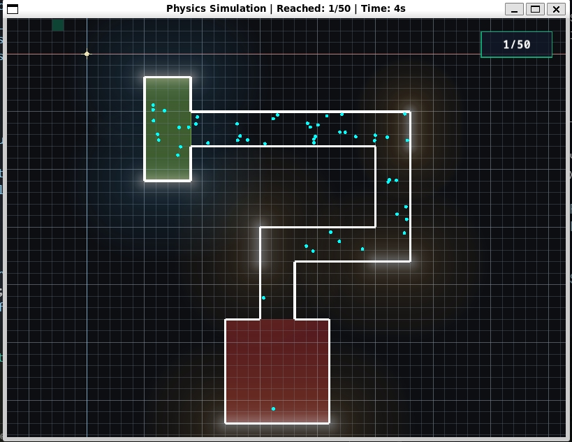
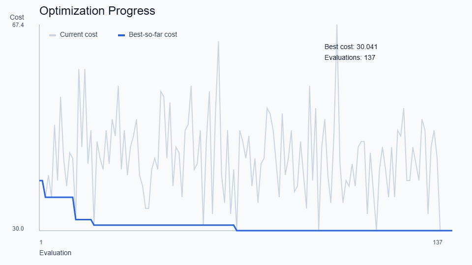

# Симуляция физики идеального газа (C++23 & SFML 3.1.0)

Физическая интерактивная симуляция идеального газа (частиц, упруго сталкивающихся со стенами и препятствиями) в замкнутом настраиваемом пространстве произвольной формы (коридоре/комнатах).

Проект использует современный стек C++23, графическую библиотеку SFML 3.1.0 и библиотеку парсинга конфигурационных файлов yaml-cpp.



---

## Основные возможности симуляции

1. Физика реального газа (Потенциал Леннарда-Джонса):
   * Частицы взаимодействуют между собой по потенциалу 6-12 (Леннарда-Джонса), что обеспечивает реалистичное отталкивание при сближении и слабое притяжение на средних дистанциях.
   * Вычисление ускорения каждой частицы на каждом шаге и интегрирование скоростей/координат по полунеявной схеме Эйлера.
   * Частицы упруго отражаются от внешних границ и внутренних препятствий.
   * Скорости и направления движения частиц генерируются случайно при старте.
   * Поддержка сверхмалого шага физического времени ($dt$) и субшагов за кадр ($physics\_steps\_per\_frame$) для стабильности крутых межатомных сил.

2. Интерактивная камера и сетка:
   * Перемещение камеры (Pan): зажмите Левую Кнопку Мыши (ЛКМ) и перетаскивайте сцену.
   * Масштабирование (Zoom-to-Cursor): крутите колесико мыши для масштабирования в точку под курсором.
   * Адаптивная координатная сетка: сетка автоматически увеличивает шаг (каждые 10 линий), если масштаб становится слишком мелким, предотвращая падение производительности рендеринга.
   * Курсор-превью: зеленый квадрат под курсором, автоматически привязывающийся к шагу сетки.
   * Адаптивное изменение размера окна: при изменении размеров окна пропорции сцены не растягиваются, сохраняя правильный масштаб физических объектов.

3. Архитектура комнат (Compartments):
   * Границы сцены строятся из набора смежных полигонов-отсеков (compartments).
   * Программа автоматически вычисляет внешние стены (границы): ребра полигонов, которые плотно прилегают друг к другу в местах стыков, распознаются как «проходы» и не создают физических препятствий. Частицы беспрепятственно перелетают между комнатами.
   * Физические коллизии рассчитываются только для неразделяемых внешних ребер.
   * Автоматическая привязка спавн-зоны к любому отсеку по его названию с отрисовкой в виде полупрозрачной синей области.

---

## Физическая модель взаимодействия (Потенциал Леннарда-Джонса 6-12)

В симуляцию добавлено реальное физическое взаимодействие между частицами газа с помощью **потенциала Леннарда-Джонса (6-12)**. Это позволяет моделировать эффекты реального газа (столкновения, взаимное расталкивание, диффузию) на микроуровне.

### 1. Формула потенциала
Потенциал взаимодействия двух нейтральных частиц, находящихся на расстоянии $r$ друг от друга, описывается уравнением:

$$V(r) = 4\epsilon \left[ \left(\frac{\sigma}{r}\right)^{12} - \left(\frac{\sigma}{r}\right)^6 \right]$$

где:
* $\epsilon$ — глубина потенциальной ямы (энергия связи, определяющая интенсивность взаимодействия).
* $\sigma$ — характерный диаметр частицы (расстояние, на котором потенциал равен нулю).

### 2. Сила межатомного взаимодействия
Сила, действующая на частицу $i$ со стороны частицы $j$, вычисляется как градиент потенциальной энергии со знаком минус: $\vec{F}_{ij} = -\nabla V(r)$. Для пары частиц формула силы имеет вид:

$$\vec{F}_{ij} = \frac{24\epsilon}{r^2} \left( \frac{\sigma}{r} \right)^6 \left[ 2\left(\frac{\sigma}{r}\right)^6 - 1 \right] \vec{r}_{ij}$$

где $\vec{r}_{ij} = \vec{r}_i - \vec{r}_j$ — вектор разности положений между частицей $i$ и $j$, а $r = |\vec{r}_{ij}|$.
* **Отталкивание ($r < 2^{1/6}\sigma$):** при близком расстоянии электронные оболочки перекрываются, создавая сильное отталкивание (член слагаемого $r^{-12}$). Сила сонаправлена с $\vec{r}_{ij}$ и расталкивает частицы.
* **Притяжение ($r > 2^{1/6}\sigma$):** на средних расстояниях действуют слабые ван-дер-ваальсовы силы притяжения (лондоновские дисперсионные силы, член слагаемого $-r^{-6}$).
* **Стабильность коллизий:** чтобы избежать деления на ноль и бесконечных сил при перекрытии частиц в численном счете, эффективное расстояние снизу ограничено: $r_{\text{eff}} = \max(r, 0.5\sigma)$.

### 3. Расчет ускорения и интегрирование
Ускорение частицы $i$ на каждом шаге симуляции вычисляется в соответствии со Вторым законом Ньютона:

$$\vec{a}_i = \frac{\sum_{j \neq i} \vec{F}_{ij}}{m_i}$$

В нашей модели масса всех частиц принята за единицу ($m_i = 1.0$). Для обеспечения численной устойчивости ускорение жестко ограничивается сверху величиной $a_{\text{max}}$ (настройка `lj_max_acceleration`).

Обновление скоростей и координат выполняется по **полунеявной схеме Эйлера (Semi-implicit Euler)**:

$$\vec{v}_i(t + dt) = \vec{v}_i(t) + \vec{a}_i(t) \cdot dt$$

$$\vec{r}_i(t + dt) = \vec{r}_i(t) + \vec{v}_i(t + dt) \cdot dt$$

Данная схема значительно стабильнее классической явной схемы Эйлера, так как лучше сохраняет фазовый объем (является симплектической).

### 4. Численная стабилизация (Sub-stepping)
Потенциал Леннарда-Джонса имеет экстремально крутую стенку отталкивания. Чтобы частицы не «пролетали» сквозь эту стенку за один шаг по времени (что вызывает числовой нагрев и взрывы скоростей), шаг интегрирования $dt$ уменьшен до $0.001$ с, а симуляция выполняет $10$ подшагов за один кадр (`physics_steps_per_frame: 10`). Это предотвращает туннелирование частиц сквозь стены и обеспечивает физически стабильное поведение.

---

## Требования к окружению

Для сборки проекта на Ubuntu/Linux требуются следующие компоненты:

1. Компилятор C++: GCC 14 (пакет g++-14) с поддержкой C++23.
2. Система сборки: CMake (версия 3.20+) и утилита make.
3. SFML 3.1.0: Установленная локально в директорию ~/.local (включая зависимости).
4. Дополнительные системные библиотеки:
   ```bash
   sudo apt install libmbedtls-dev libssh2-1-dev
   ```

---

## Структура проекта

Проект организован по стандарту Pitchfork Layout (подход merged header/source). Исходный код и заголовочные файлы сгруппированы по логическим подмодулям внутри директории `src`:

```text
├── CMakeLists.txt         # Конфигурационный файл CMake для сборки проекта
├── Makefile               # Удобная обертка для команд CMake (сборка, запуск, очистка)
├── README.md              # Этот файл с описанием проекта
├── config.yaml            # Конфигурация симуляции, физики и комнат
├── tools/                 # Вспомогательные Python-утилиты для оптимизации и графиков
│   ├── optimize_fields.py
│   └── plot_optimization_log.py
└── src/                   # Основная директория исходного кода
    ├── main.cpp           # Точка входа в программу
    ├── core/              # Ядро приложения и конфигурация
    │   ├── Config.hpp     # Структура конфигурации
    │   ├── Config.cpp     # Реализация загрузки и парсинга config.yaml
    │   ├── Simulation.hpp        # Интерфейс ядра симуляции
    │   ├── Simulation.cpp        # Конструктор, шаг, headless-цикл и отчетность
    │   ├── SimulationPhysics.cpp # Физическое обновление частиц
    │   └── SimulationSpawn.cpp   # Инициализация и спавн частиц
    ├── graphics/          # Графический цикл, камера, ввод и рендеринг SFML
    │   ├── Visualizer.hpp # Декларация визуализатора
    │   └── Visualizer.cpp # Реализация окна, ввода и отрисовки
    ├── physics/           # Математические вычисления и физический движок
    │   ├── Physics.hpp    # Декларация чистых функций столкновения и геометрии
    │   └── Physics.cpp    # Реализация упругого отскока и point-in-polygon тестов
    └── entities/          # Физические сущности симуляции
        ├── Particle.hpp   # Модель физической частицы газа
        ├── Particle.cpp   # Реализация перемещения и отрисовки частиц
        ├── Environment.hpp # Класс окружения (автоматическое вычисление внешних стен)
        ├── Environment.cpp # Алгоритм удаления внутренних стыков комнат
        ├── Zone.hpp       # Логические зоны (спавн, финиш)
        └── Zone.cpp       # Подсчет частиц внутри зон и их цветовое выделение
```

---

## Файл конфигурации (config.yaml)

Все настройки симуляции подгружаются динамически без перекомпиляции программы:

```yaml
grid_size: 20.0
dt: 0.001
physics_steps_per_frame: 10
particle_count: 50
particle_radius: 3.0
random_seed: 42
lj_enabled: true
lj_epsilon: 50.0
lj_sigma: 6.0
lj_cutoff: 15.0
lj_max_acceleration: 20000.0

window:
  width: 800
  height: 600
  title: Physics Simulation

background_color:
  r: 12
  g: 14
  b: 18

simulation_elements:
  compartments:
    - name: start_reservoir
      polygon:
        - {x: 100, y: 40}
        - {x: 180, y: 40}
        - {x: 180, y: 100}
        - {x: 180, y: 160}
        - {x: 180, y: 220}
        - {x: 100, y: 220}
    - name: top_channel
      polygon:
        - {x: 180, y: 100}
        - {x: 560, y: 100}
        - {x: 500, y: 160}
        - {x: 180, y: 160}
    # ... другие комнаты ...

  zones:
    - type: spawn
      compartment: start_reservoir
    - type: target
      compartment: end_reservoir

  obstacles: []
  radial_fields: []
  segment_fields:
    - start: {x: 560, y: 100}
      end: {x: 560, y: 160}
      intensity: -1500.0
      optimize: true
      bounds: [-8000.0, -500.0]
```

### Настройка и создание своих полей
Вы можете добавлять собственные источники силовых полей в блоке `simulation_elements` файла `config.yaml`:
1. **Точечное (радиальное) поле:** Пропишите новый элемент в секцию `radial_fields`. Задайте точку центра (`center`), силу `intensity` (знак определяет притяжение/отталкивание) и радиус `min_radius` (ограничение сближения). На экране отображается в виде красивого кругового градиента.
2. **Линейное (сегментное) поле:** Пропишите отрезок в секцию `segment_fields`. Укажите начало (`start`) и конец (`end`) пластины, а также силу `intensity` (сила действует перпендикулярно отрезку в обе стороны). На экране отображается в виде светящейся обкладки с затухающими полосами по бокам.
3. **Поле для оптимизации:** Чтобы Python-оптимизатор включил сегментное поле в поиск, добавьте `optimize: true` и диапазон `bounds: [min, max]`.

Цвета полей генерируются автоматически: **теплый желтый** для притяжения и **холодный голубой** для отталкивания. Ширина свечения пропорциональна интенсивности поля.

---

## Сборка и запуск

Все операции сборки обернуты в удобный Makefile:

* Собрать проект:
  ```bash
  make build
  ```
  (генерирует файлы CMake и компилирует приложение в папку build/)

* Запустить симуляцию в обычном графическом режиме (с окном):
  ```bash
  make run
  ```
  (собирает измененные файлы и запускает окно приложения)

* Запустить симуляцию в консольном (headless) режиме:
  ```bash
  make headless
  ```
  (или `make config-headless CONFIG=config_optimized.yaml`. Симуляция будет запущена без создания графического окна и вывода графики, с отчетами о прогрессе прямо в консоль)

* Быстрый тест оптимизатора:
  ```bash
  make optimize-quick
  ```

* Полный запуск оптимизатора:
  ```bash
  make optimize OPT_ARGS="--seed 42 --maxiter 10"
  ```

* Построить SVG-график по логу оптимизации:
  ```bash
  make plot
  ```

* Запустить симуляцию с оптимизированным конфигом:
  ```bash
  make run-optimized
  ```

* Запустить симуляцию с произвольным конфигом:
  ```bash
  make config-run CONFIG=config_optimized.yaml
  ```

* Посмотреть справку по доступным аргументам запуска:
  ```bash
  make help
  ```

* Очистить артефакты сборки:
  ```bash
  make clean
  ```
  (полностью удаляет папку build/)

* Пересобрать проект с нуля:
  ```bash
  make rebuild
  ```

---

## Headless-режим (Режим без окна)

Headless-режим предназначен для запуска симуляции в консоли без X11-сессии (например, на серверах, в Docker-контейнерах или CI-системах). 

В этом режиме:
1. Графическая подсистема не инициализируется и окно не создается.
2. Шаги физического времени продвигаются с максимально доступной скоростью процессора.
3. Раз в 1 секунду виртуального времени в `stdout` выводится машинно-читаемый лог вида `SIM_STATUS virtual_time=... reached=... total=...`.
4. Симуляция автоматически завершается при достижении всеми частицами целевого резервуара либо по таймауту в 1000 секунд виртуального времени.
5. Финальный результат выводится строкой `SIM_RESULT success=... virtual_time=... reached=... total=...`.

---

## Управление камерой в окне симуляции

* ЛКМ (Зажатие и перетаскивание): Свободное панорамирование (перемещение) камеры по миру.
* Колесико мыши вверх/вниз: Плавное приближение/удаление в точку, на которую указывает курсор мыши.
* Клавиша Escape: Безопасный выход из симуляции.

---

## Оптимизация параметров полей (Differential Evolution)

Для поиска наиболее оптимальных значений интенсивности силовых полей в коридоре предусмотрен Python-скрипт `tools/optimize_fields.py`. Скрипт использует алгоритм дифференциальной эволюции из `scipy.optimize`, запускает симуляцию в headless-режиме и автоматически подбирает интенсивности только у тех `segment_fields`, которые помечены в `config.yaml` как `optimize: true`.

MVP-логика оптимизатора намеренно простая: прогон считается удачным, когда до цели добирается не менее **80% всех частиц**. На этой точке симуляция останавливается досрочно, а стоимость равна виртуальному времени достижения порога. Если порог не достигнут, назначается простой штраф за недобор частиц. Для воспроизводимости используется один фиксированный `random_seed`.

Это отличается от полного критерия завершения самой C++-симуляции: в обычном `headless`-запуске она считает успехом доставку **100% частиц**, тогда как Python-оптимизатор для ускорения поиска минимизирует время достижения порога **80%**.

Для работы с Python-скриптами в проекте используется `uv`.

### Настройка виртуального окружения и запуск:

1. Если виртуальное окружение еще не создано, подготовьте его:
   ```bash
   uv venv
   uv pip install scipy pyyaml
   ```

2. Запустите скрипт оптимизации:
   * **Быстрый тестовый запуск** (для проверки):
     ```bash
     make optimize-quick
      ```
   * **Полноценная оптимизация**:
     ```bash
     make optimize OPT_ARGS="--seed 42 --maxiter 10"
      ```

### Параметры запуска:
* `--config <PATH>`: Исходный конфиг симуляции. По умолчанию `config.yaml`.
* `--output <PATH>`: Куда сохранить оптимизированный конфиг. По умолчанию `config_optimized.yaml`.
* `--exec <PATH>`: Путь до собранного исполняемого файла. По умолчанию `build/sfml_app`.
* `--log <PATH>`: CSV-лог всех оценок оптимизатора. По умолчанию `optimization_log.csv`.
* `--seed <N>`: Переопределить `random_seed` на время оптимизации и записать его в выходной конфиг.
* `--popsize <N>`: Множитель размера популяции (размер популяции равен `N * число_оптимизируемых_полей`). По умолчанию 3.
* `--maxiter <M>`: Максимальное количество итераций/поколений эволюционного поиска. По умолчанию 5.
* `--no-polish`: Отключает финальную локальную доводку параметров алгоритмом Нелдера-Мида (Nelder-Mead).

После успешного завершения исходный файл `config.yaml` остается полностью нетронутым, а оптимальные параметры сохраняются в файл `config_optimized.yaml`.

### График для защиты

После прогона оптимизатора можно построить простой SVG-график без дополнительных зависимостей:

```bash
make plot
```

По умолчанию будет создан файл `optimization_progress.svg` с двумя кривыми:
* текущий `cost` на каждой оценке;
* лучший `cost` на данный момент (`best-so-far`).



### Запуск симуляции с эффективными параметрами:
Для запуска симуляции с использованием найденного файла параметров удобнее использовать готовые цели `Makefile`:

* **Графический режим:**
  ```bash
  make config-run CONFIG=config_optimized.yaml
  ```
* **Headless-режим:**
  ```bash
  make config-headless CONFIG=config_optimized.yaml
  ```
* **Прямой запуск исполняемого файла:**
  ```bash
  ./build/sfml_app -c config_optimized.yaml
  ```
